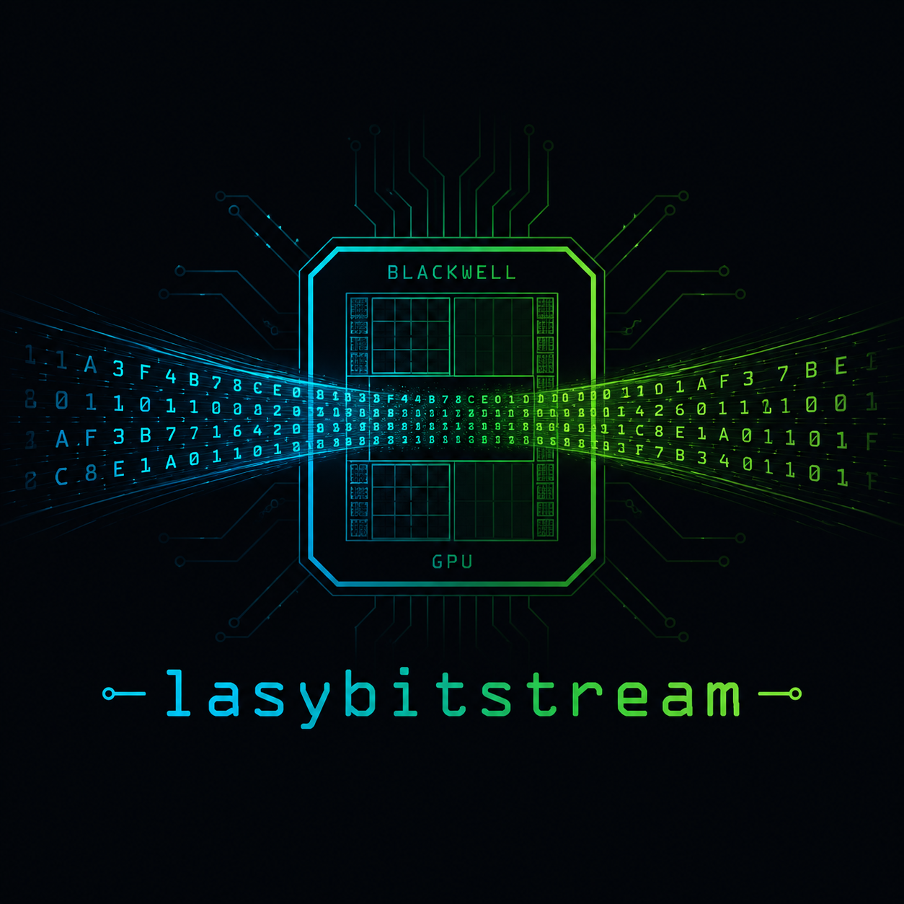

<p align="center">
  
</p>

<h1 align="center">lasybitstream</h1>

<p align="center">
  A from-scratch <b>clang + CUDA</b> aggregate-throughput inference engine,<br>
  custom-built for <b>Qwen3.6-27B</b> on the <b>NVIDIA DGX Spark</b> (GB10, sm_121).
</p>

<p align="center">English · <a href="README.md">中文</a></p>

---

**lasybitstream** is a hand-written inference engine — no PyTorch, no cuBLAS, no
CUTLASS, no dependencies — for **Qwen3.6-27B** (`Qwen3_5ForConditionalGeneration`,
NVFP4) on the **DGX Spark** (GB10 Grace-Blackwell, `sm_121`, aarch64, 128 GB unified
LPDDR5x @ ~273 GB/s). Every kernel is written from scratch in CUDA, compiled with
`clang++` (host) + `nvcc` (device, `-arch=sm_121a`).

## Why aggregate throughput

Decode is memory-bandwidth bound — one generated token reads every active weight once:

```
Qwen3.6-27B @ NVFP4  ≈ 22 GB active weights / token (incl. BF16 GDN proj + lm_head)
GB10 bandwidth       ≈ 273 GB/s
single-stream ceiling = 273 / 22 ≈ 12.4 tok/s
```

Single-stream 50-500 tok/s is **physically impossible** for a dense 27B (on-chip
memory < 100 MB cannot evade the HBM read-once cost). The only way through is
**weight reuse across a batch** — one weight sweep serves `B` rows, so aggregate
throughput scales with batch. The goal is to beat the vLLM baseline (~506 tok/s @
batch 128).

## Model (Qwen3.5 = Qwen3-Next arch)

- Dense 27B, 64 layers: **48 GDN (gated delta-net) linear-attention** + **16 full
  softmax-attention**, pattern 3-linear-then-1-full. hidden 5120, 24 q / 4 kv heads,
  head_dim 256, vocab 248320, partial RoPE 0.25.
- **NVFP4** (compressed-tensors): `weight_packed` (fp4 e2m1) + `weight_scale`
  (fp8 e4m3, per-16) + `weight_global_scale` (fp32). GDN in-projections stay BF16.
- **Vision tower** `model.visual.*` (27-layer ViT + 2D RoPE + 2×2 merger → 5120).
- Ships an **MTP** head for speculative decoding. Gemma-style RMSNorm.

## Working / verified

Every kernel is numerically matched against a reference; end-to-end vs an FP32 golden dump.

| component | check |
|---|---|
| NVFP4 dequant / GEMM | bit-exact / max_rel 4e-4; **hardware FP4 decode** (`cuda_fp4.h`, sm_121a) |
| GDN gated-delta-net | recurrence + gating + gated-norm vs fla, max_rel 2.5e-4 |
| **full 64-layer forward** | vs FP32 golden: layer-0 2e-4, **greedy next-token exact** |
| byte-level BPE tokenizer | **35/35 byte-exact** vs HF + ChatML template |
| **vision end-to-end** | image → "This image displays a smooth color gradient…" (correct) |
| **MTP speculative decode** | output byte-identical to greedy (greedy verify) |
| **aggregate batching** | staged GEMM amortizes the weight read, M=4 → 25.9 tok/s (2.4× single) |

**Capabilities**: native forward (KV + GDN-state cache, incremental decode) · text +
vision multimodal · OpenAI + Anthropic dual API (streaming + non-streaming) · MTP
speculative decoding · aggregate batching.

## Build & run

```bash
cmake -B build -DCMAKE_CUDA_ARCHITECTURES=121a    # clang++ host + nvcc device
cmake --build build -j
./build/lbinfer  /path/to/Qwen3.6-27B-NVFP4 test          # validate forward vs golden
./build/lbinfer  /path/to/Qwen3.6-27B-NVFP4 test bench    # aggregate throughput curve
./build/lbtest_tok /path/to/Qwen3.6-27B-NVFP4 test/tok_battery.json  # tokenizer
./build/lbserve  /path/to/Qwen3.6-27B-NVFP4 8080         # OpenAI + Anthropic server
```

```bash
# OpenAI
curl http://127.0.0.1:8080/v1/chat/completions -d \
  '{"messages":[{"role":"user","content":"The capital of France is"}],"max_tokens":16}'
# Anthropic
curl http://127.0.0.1:8080/v1/messages -d \
  '{"max_tokens":40,"messages":[{"role":"user","content":"Hi"}]}'
```

`POST /v1/chat/completions` (OpenAI, streaming SSE + non-streaming), `POST /v1/messages`
(Anthropic native), `GET /v1/models`, `/health`, bound to `127.0.0.1` only.

Requires CUDA 13 + clang. Runs on `sm_121` (GB10) only. `clang` cannot emit `sm_121`
device code directly (knows ≤ CUDA 12.3), so device code goes through `nvcc -ccbin clang++`.

## Performance roadmap (toward 500+ tok/s/card)

- **Tensor-core GEMM**: staged f32 batching already amortizes the weight read but hits
  the f32 compute wall (~25 tok/s); bf16/fp4 `mma.sync` tensor cores raise it ~20×, making
  batching weight-bandwidth-bound again (M=64 → ~800 tok/s). WIP kernel in `cuda/nvfp4.cu`
  (`LB_WMMA=1`).
- **MTP acceleration**: cut draft overhead + eliminate the re-advance (per-token state snapshot).
- **NVMe + RAM hybrid hot KV cache**: spill cold KV to disk for long context / high concurrency.
